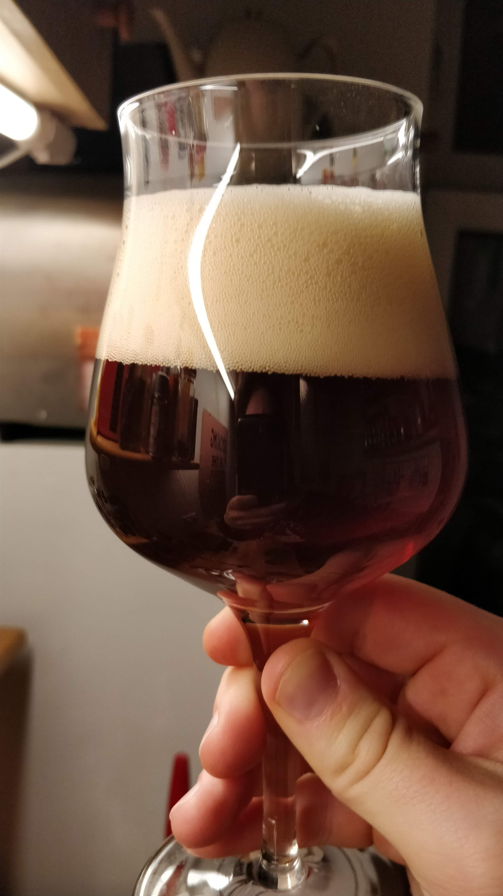

# Nerdkiez Winter Ale

First time brewed: 8 December 2018

Brewed again 2 March 2019

## Description

Dark ale to keep you warm in the winter time. Comes with a beautiful foam top.

## Ingredients

20L Main pour
10L After pour

### Mash

- Pale Ale malt 3,45 kg
- Corn flakes 500g
- Cara dark 400g
- Cara light 300g
- Cara red 300g
- Roasted barley 50g

### Hops / flavoring

Magnum: 23g with 3.2% (80min)
EKG: 9g 5,8% (10 min)

## Brewing

|       |         |        |
|-------|---------|--------|
|Mash in| 62°C    |        |
|Protein rest| 58°C |20min |
|Maltose rest| 62°C |30min  |
|Sugar rest| 72°C   |20min |   
|Mash out         |78°C   ||

## Brewer's tip

Drink with mates and nerds!
